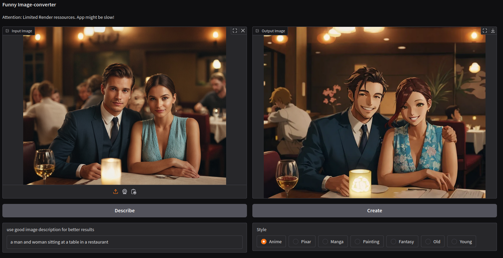

# 🎨 AI-Anime-Maker - Turn Your Photos into Anime with a Dash of AI Magic! 🌟
Transform your photos into stunning anime art using the power of Stable Diffusion. Welcome to AI-Anime-Maker - where every picture gets a whimsical anime makeover!

Status: V1 - Stable and rocking! 🎉

- [🎨 AI-Anime-Maker - Turn Your Photos into Anime with a Dash of AI Magic! 🌟](#-ai-anime-maker---turn-your-photos-into-anime-with-a-dash-of-ai-magic-)
  - [🎯 Goal](#-goal)
  - [🎨 Model Support](#-model-support)
  - [🖌️ Expanding Your Artistic Horizons](#️-expanding-your-artistic-horizons)
  - [🛠️ Installation](#️-installation)
    - [Prerequisites](#prerequisites)
    - [Now](#now)
  - [⚙️ Configuration](#️-configuration)
  - [🌟 Feature: Analytics](#-feature-analytics)
  - [🌟 Feature: Token based generation](#-feature-token-based-generation)
  - [🛠️ Development and Deployment](#️-development-and-deployment)
  - [📜 License](#-license)
  - [🤝 Contributing](#-contributing)
  - [🌟 Outlook (Features which could be useful)](#-outlook-features-which-could-be-useful)

## 🎯 Goal
Our mission (and the mission of our future tools) is to provide simple, dedicated solutions for specific purposes. Unlike the complex and convoluted atomic0000, our tools are designed to be user-friendly for everyone, not just tech wizards!



Just imagine! A world where converting photos to anime is as easy as pie. 🥧

To make the generation results even better, we implemented a local image-to-text conversion, which describes the input of your source image automaticaly. 

## 🎨 Model Support
AI-Anime-Maker supports a variety of models, from Hugging Face models to safetensor files. You can download these models from multiple websites like https://civit.ai for free. This flexibility allows you to experiment with different models to find the perfect one for your needs.

## 🖌️ Expanding Your Artistic Horizons
If you want to modify pictures to create different styles of paintings from artists like Picasso or others, you can easily do so by adapting the "Style" section in the configuration file. The sky's the limit! 🌌

## 🛠️ Installation
Tested on Linux, but it should work like a charm on Windows and Mac too (fingers crossed! 🤞). If you encounter any hiccups on Windows or Mac, please let me know, or better yet, create a pull request with the fix. You're awesome! 🚀

### Prerequisites
* Python 3.12 (tested with it)
* Python venv module (should be there with python)
* Python pip (should be tehre as well)
* a GPU with 4-8GB VRAM depending on Model and Image Size
(CPU works also but is very slow)


### Now
1. Download the repository.

```sh
git clone https://github.com/yourusername/ai-anime-maker.git
cd ai-anime-maker
```

2. Run the magical command: 
```sh 
./run.sh
```
3. Have fun

Note: The first run might take a while as it downloads multiple gigabytes of AI models and required libraries. Patience, young grasshopper! 🐢

## ⚙️ Configuration
Customize your anime-creating experience using the app.config file. Here's a sneak peek at the basic structure:

```ini
[General]
# Name of the App and Browser Tab
app_title=AI Anime Maker

# if set, a poup message for the user. You can use any HTML to format it
#app_disclaimer=This App is made for educational purpose.<br><br><p align=left>It is shared to you by sponsored hardware.</p>

# the message showed below the app title
user_message=Have fun creating funny pictures out of your photos!

# defines the port where the app is starting, if not defined, a random port will be choosen
#port=7860

#define if the application should create a internet reachable link via gradio shared tunnel function
is_shared=false

# With this feature you can determine which style is mostly used and much more
# be aware of data privacy and regulations
analytics_enabled=false

# Path to the analytics database (will be created if not existing)
analytics_db_path=./analytics/analytics.db

# if available it will be used to determine country and city in analytics
# official source: https://dev.maxmind.com/geoip/geoip2/geolite2/
analytics_city_db=./GeoLite2-City.mmdb


[Token]
# This section contains the feature of token based image generation

# if active (default=true), users can generate images only if they have token
# token can be optained by uploading images
enabled=false

# if set, a explanation which will be shown to the user
explanation=You will receive Token by using new images. Each generation will cost you 1 Token. We implemented this to avoid misuse.

# amout of token users get a a new image
new_image=3

# time before the user will get token again for this image in the same session, default 240
image_blocked_in_minutes=240

# bonus of tokens they get if the image contains at least one face
bonus_for_face=3
# bonus of tokens if the faces smiles (not implemented so far)
bonus_for_smile=1
# bonus of token they get if the image is recognized as "cute"
bonus_for_cuteness=3

[GenAI]
# a local savetensors file or a Huggingface Model (will be downloaded)
default_model=./models/toonify.safetensors

# a local folder where the system can look for the specified model 
#model_folder=./models/

# the url to download the model if the file specified in "model" is not existing
#safetensor_url=https://civit.ai/...

# amount of parallel renderings (depends on GPU size), default 1
execution_batch_size=1

# the amount of steps used to generate the image
# the value should be lower for systems without GPU
default_steps=60

# value between 0 and 1
# 0=no changes to the input image
# 1=maximum changes (like no input file)
# this Setting is appied to all Styles who don't define a strength
# good values are 0.4 to 0.6
default_strength=0.5

# the maximum width or height of the output image
# change the value depending on teh model and available RAM on the GPU
max_size=1024

[UI]
# visual style of the application.
# you can define your own style or selected e.g. from here: https://huggingface.co/spaces/gradio/theme-gallery
theme=allenai/gradio-theme

# true=enables the slider to modify strengths in the UI
show_strength=false

# true=enables the slider to modify steps in the UI
show_steps=false

[Styles]
# The number of styles listed below.
style_count=2

# The negative prompt applied to all styles.
general_negative_prompt=realistic photo, wrong fingers, ugly, sad, brutal, violence

style_1_name=Test 1
style_1_prompt=disney-style painting
style_1_strength=0.6
style_1_negative_prompt=anime

style_2_name=Test 2
style_2_prompt=a anime style painting
# Optional settings.
#style_2_strength=0.3
#style_2_negative_prompt=oil painting
```
## 🌟 Feature: Analytics
If you have activated analytics, a few interesting data will be saved. This includes the usage of styles, time of activities and languages of the requesting clients. With this information you can optimize the configuration of your system and save costs if it runs on a cloud.
For privacy reasons, there will be no data stored which allows identification of users.

If you want to have information of the origin (Continent and Country) of Users, you need to use a Geo2Lite DB which is not included in this app. For more information see https://dev.maxmind.com/geoip/geoip2/geolite2/
This information can only be determined if you expose your application directly to the users without using the "IsShared" feature. IsShared (our default) will always run over a FRT Proxy which protectes user information from the app for privacy reasons.
To get more information about this topic and security concerns check the gradio documentation. 

You can analyze the stored data via the Analyze_Usage jupyter notebook in this project.
For that use an IDE like VSCode or run ```notebook lab Analyze_Usage.ipynb``` from the application folder.

## 🌟 Feature: Token based generation
If you have activated token based generation,  then the users can't build unlimited amount of images based on one source file. For generation they need token (on for each) and such toklen will be received for uploaded images.
That prevents the system for misuse. In our public beta we have seen that users try to generate inappropiate content by tweaking the prompt. It wasn't succesful as our used model don't support that and the style description and negative prompt prevent it in addition. But finally users wasted computing times and with that slowed down the system for others. That was the main reason why we implemented token. It's turned off by default, but feel free to switch it on.

## 🛠️ Development and Deployment
For development and deployment purposes, you can create a "local.config" file (copy of app.config) which allows you to use dedicated configuration, e.g. local model folder without affecting the release/standard configuration. 
This is useful for updating the app including app.config without affecting you local settings.

Interesting settings for dev environments are:
* [General][debug] (true/false) - enable model selection and more output
* [GenAI][skip] (true/false) - skip the GenAI part (used for UI Development)

Command line options:
* `--debug` - Enable debug mode for detailed logging output (alternative to setting debug=true in config)
  
Happy coding! 💻

---
Get ready to unleash your inner artist and turn your photos into anime masterpieces! 🌈✨


## 📜 License
This project is licensed under the GPL3 License - see the [LICENSE.md] file for details.

## 🤝 Contributing
We welcome contributions! Please read our Contributing Guidelines for details on the process for submitting pull requests.

## 🌟 Outlook (Features which could be useful)
* Preview on generation Process
* Better Image description generation
* Better Memory Handling for higher resolutions
* SDXL and FLUX Support
* More Styles or Groups of Styles
